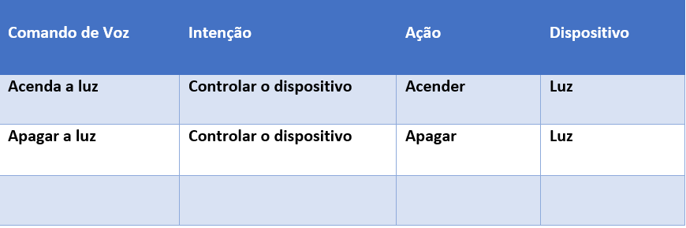

## Análise de Sentimentos Com Language Studio no Azure AI

### Durante as vídeo aulas Desenvolvida pela <a href="https://web.dio.me/">Digital Innovation one</a> observei o quão valioso é a Análise de Sentimentos. As aulas foram ministradas por Valéria Baptista que trouxe uma visão geral do Azure AI Language Studio e abordou os príncipais tópicos:

* ### Análise de sentimentos
* ### Respostas a perguntas
* ### Compreensão de Linguagem natural
* ### Processamento de texto e fala

## Análise de Sentimentos 

### Objetivos:

* ### Identifica o texto fornecido e informar se o sentimento é positivo, negativo ou neutro.

* ### Indicar a pontuação de confiança do texto para saber o quanto ele pode ser considerado positivo, negativo ou neutro.

### O Language Studio nos ajuda a dar uma classificação sobre o texto que está sendo verificado com base na compreensão do idioma e na classificação personalizada.

## Respostas a Perguntas

### Utilizando a base de conhecimento pré-criada é possível extrai respostas diretamente de um texto fornecido.

### Implementação

* ### Crie um projeto de Resposta a Perguntas no Language Studio

* ### Adicione fontes de conhecimento
* ### Treine o seu projeto

## Compreensão da Lingugem Coloquial

### Funcionalidades

* ### Reconhecimento de intenções
* ### Extração de entidades
* ### Treinamento personalizável para vocabulários específicos

### Exemplo de Análise

### suponha que você tenha uma Alexa e precise que através de um comando de voz uma funcionalidade específica seja ativada. Então, pedirá para acender a luz e ela executará o seu comando de voz.

## Speech Studio

### Como funciona?

### Você envia um arquivo de áudio e ele vai transcrever em texto ou você envia um texto e ele vai gerar uma voz com o conteúdo contido no texto.

### Objetivos:

* ### Conversão de fala em texto
* ### Texto em fala com vozes naturais
* ### Tradução de fala em tempo real

